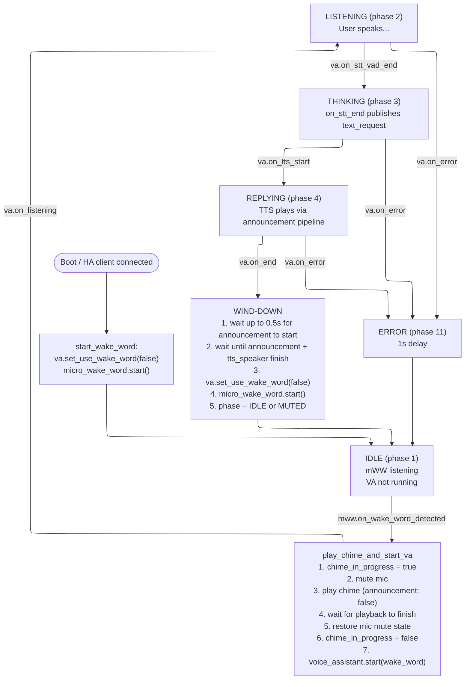
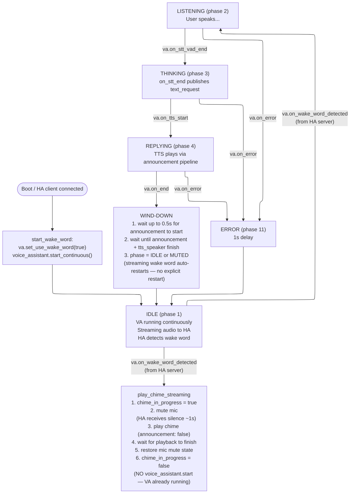
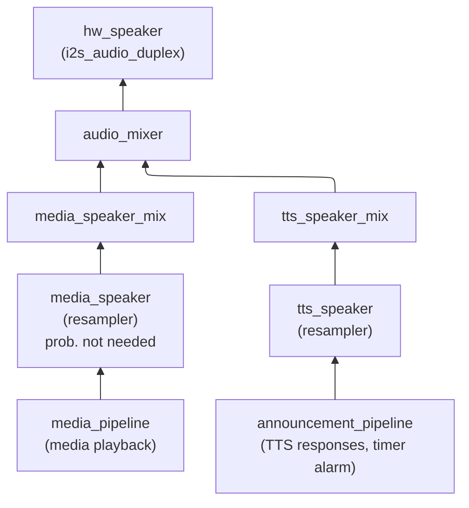

# Duplex Audio Home Assistant Voice Satellite With Wake Chime

Custom ESPHome configuration for the ESP32-S3-Box-3, forked from
[esphome/wake-word-voice-assistants](https://github.com/esphome/wake-word-voice-assistants)
(`esp32-s3-box-3/esp32-s3-box-3.yaml`).

**IMPORTANT** - In "Streaming" mode (wake word detection on HA with openWakeWord) we can't
pause the VAD. So the longer your chime is, the less time you have to start speaking afterwards.
With micro_wake_word (On-Device) you can make the chime as long as you want since we don't kick off the
assistant until after chime is done.

## Changes from upstream

- **Duplex I2S audio from esphome-intercom** swap `i2s_audio` platform for `i2s_audio_duplex` component from `esphome-intercom`. Allows simultaneous microphone capture and speaker output on a shared I2S bus without hack-ey starting and stopping of the mic or speaker pipelines. Esp for "streaming" mode where killing and restarting the voice_assistant causes all sorts of weird bugs.

- **Mixer / resampler speaker stack** Swap `i2s_audio` speaker with hardware speaker via an `audio_mixer` on two channels (`media_speaker_mix`, `tts_speaker_mix`), each fronted by a `resampler`. Media and TTS/announcement audio are mixed independently.
  - **NOTE** This is probably not necessary if you encode local files correctly
    as HA can transcode media during playback for streamed audio. If you need the memory, can probably remove the resamplers. I was just too lazy to keep testing once this worked.
- **Wake word chime** -- A confirmation chime plays on-device immediately after wake word detection in both modes (on-device mWW and streaming). The mic is muted during chime playback to prevent feedback, then unmuted before the voice pipeline proceeds.
- **PSRAM optimizations** -- Added `CONFIG_SPIRAM_FETCH_INSTRUCTIONS` and
  `CONFIG_SPIRAM_RODATA` sdkconfig options; mixer and resampler tasks use PSRAM
  stacks.
  - **NOTE** This is also probably avoidable if desired, I was just too lazy to do it properly.

## Usage Notes
- Either checkout `esphome-intercom` repo to `../esphome-intercom` or swap the  `external_component` config for the `github://n-IA-hane/esphome-intercom` version.
- `wake_chime_sound` is just a crappy placeholder - replace with something fun.
- `announcement: false` flag on chime playback is set to avoid triggering `on_announcement`.
- `chime_in_progress` global prevents blocks `media_player.on_idle` callback from restarting the wake word engine __I think you could prob remove this logic but again: lazy__.

---

**NOTE - AI Warning** The rest of this doc is AI generated (but still reviewed) because I continue to be lazy but still want some docs so that future-me can debug this in two years when it breaks after the great AI pricing rug-pull.

**NOTE** These diagrams don't show the "question/response" stages where voice_assistant loops back to listening when VA asks a question - but I did test it in both flows and it works as expected.

---

## Detailed flow

### Display phases

| ID | Name           | Display page         |
|----|----------------|----------------------|
| 1  | Idle           | `idle_page`          |
| 2  | Listening      | `listening_page`     |
| 3  | Thinking       | `thinking_page`      |
| 4  | Replying       | `replying_page`      |
| 10 | Not ready      | `no_ha_page`         |
| 11 | Error          | `error_page`         |
| 12 | Muted          | `muted_page`         |
| 20 | Timer finished | `timer_finished_page`|

### Mode A -- micro_wake_word ("On device") with chime

**Key points:**
- VA is *not* running while idle. mWW owns the mic for wake word detection.
- `use_wake_word` stays `false` -- mWW detects the wake word externally and
  explicitly calls `voice_assistant.start`.
- The chime plays with `announcement: false` so it goes through the media
  pipeline. `chime_in_progress` prevents `on_idle` from prematurely restarting
  the wake word engine when the chime finishes.

### Mode B -- Streaming ("In Home Assistant") with chime

**Key points:**
- VA runs continuously in idle. `use_wake_word` is `true` so HA performs
  server-side wake word detection on the audio stream.
- The chime script does *not* call `voice_assistant.start` because the VA
  session is already active. HA simply transitions from wake-word-detected into
  the STT phase on its own.
- The ~1s of silence HA receives during chime playback falls within the normal
  post-wake-word pause window.
- At `on_end`, streaming wake word detection auto-restarts -- no explicit
  `micro_wake_word.start` or `voice_assistant.start_continuous` is needed.

### Mode comparison

| Aspect                  | Mode A (mWW / On device)                  | Mode B (Streaming / In HA)                     |
|-------------------------|-------------------------------------------|-------------------------------------------------|
| Wake detection          | `micro_wake_word` on ESP32                | HA server-side via continuous audio stream       |
| VA state while idle     | Not running; mWW owns mic                 | Running continuously (`start_continuous`)        |
| Chime trigger           | `mww.on_wake_word_detected`               | `va.on_wake_word_detected`                       |
| Chime script            | `play_chime_and_start_va`                 | `play_chime_streaming`                           |
| After chime             | Calls `voice_assistant.start(wake_word)`  | Nothing -- VA already running                    |
| After `on_end`          | Restarts mWW explicitly                   | Streaming auto-restarts                          |
| `use_wake_word` flag    | Always `false`                            | Always `true`                                    |

### media_player callbacks

These fire for TTS announcements *and* non-VA media playback in both modes:

- **`on_announcement`** -- Stops the active wake word engine (mWW or VA
  continuous) if the mic is capturing, preventing speaker output from feeding
  back into the mic. For streaming mode, waits until VA stops before proceeding.
  If VA is not running (user-initiated media, not a voice pipeline), shows the
  muted display.
- **`on_idle`** -- When media finishes and VA is not running *and*
  `chime_in_progress` is false, restarts the wake word engine and returns to
  idle. The `chime_in_progress` guard is critical: without it, the chime
  finishing would trigger a premature wake word restart before VA starts (Mode A)
  or while the pipeline is mid-flight (Mode B).

### Speaker pipeline topology

The mixer combines both sources into the single hardware I2S output. Media and
announcements can play independently without blocking each other (though in
practice the chime sequence serializes them).
